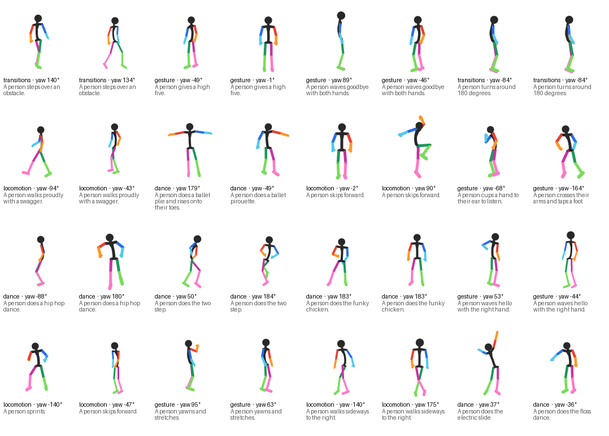
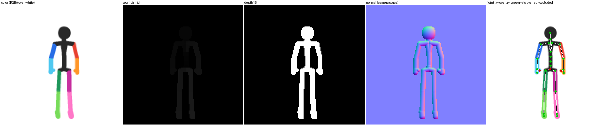

# Dancing Stick Figures — v0.1

**A small, fully-labelled synthetic video dataset for learning (and teaching) video diffusion on one consumer GPU.**

1,430 clips · 6 s @ 20 fps · 128×128 RGBA · 514,800 frames · 143 text prompts × 10 seeds × 3 cameras ·
every frame carries the 3D skeleton, camera and G-buffer (depth, normals, part segmentation) that produced it.

<p align="center"></p>

Think of it as an *MNIST for video generation*: small enough that a 64² video diffusion model trains from scratch
in a few hours on a 24 GB card, structured enough that you can **measure** what the model got wrong (missing arm?
detached leg? wrong colour?) instead of eyeballing it. It is also a clean playground for the "image model first,
then video" curriculum used by Seedance-class systems.

> **Start here →** [](https://colab.research.google.com/github/sprited-ai/dancing-stick-figures/blob/main/notebooks/dancing_stick_figures_colab.ipynb)
> **one route, end to end, ~1 h on a free T4:** look at the data → train a 64² image model → warm-start a video model from
> it → watch the GIF → let the "oracle" count the limbs. Same five commands in the
> [code repo README](https://github.com/sprited-ai/dancing-stick-figures#the-route-colab-t4-1-h--rtx-4090-20-min).
>
> **v0.1 = first public cut.** Data, labels and splits are final for this version; captions are the raw motion
> prompts (templated dense captions come in v0.2); baselines are unconditional. Feedback and issues welcome.

## Which config?

| config | rows | size | contents |
|---|---|---|---|
| `frames` (default) | 514,800 frames | 4.6 GB | 128² RGBA colour + depth16 + normals + seg + all labels |
| `mini` | 514,800 frames | 0.85 GB | **64²** RGBA colour + seg + all labels — laptops, Colab, classrooms |
| `motion` | 1,430 clips | 0.35 GB | raw generator output: world joints, rotation matrices, foot contacts |

## Quick start

```python
from datasets import load_dataset
ds = load_dataset("sprited/dancing-stick-figures", "frames", split="validation")   # 128 px frames + labels ("mini" = 64 px, 0.85 GB)
row = ds[0]
row["color"]            # PIL RGBA image (transparent background, colour-coded bones)
row["text"]             # "A person does the running man dance."
import numpy as np
xy  = np.frombuffer(row["joint_xy"],  np.float32).reshape(27, 2)   # normalised [0,1] image coords
xyz = np.frombuffer(row["joint_xyz"], np.float32).reshape(27, 3)   # metres, figure frame (x left, y up, z fwd)
vis = np.frombuffer(row["joint_visible"], np.uint8)                # 1 = joint visible in this camera
```

Motion (one row per clip, raw generator output):

```python
mo = load_dataset("sprited/dancing-stick-figures", "motion", split="validation")[0]
T = mo["n_frames"]
P   = np.frombuffer(mo["posed_joints"],   np.float32).reshape(T, 27, 3)     # world, metres
Rl  = np.frombuffer(mo["local_rot_mats"], np.float32).reshape(T, 27, 3, 3)  # per-joint local rotations
fc  = np.frombuffer(mo["foot_contacts"],  bool).reshape(T, 4)
```

Training a baseline (code: <https://github.com/sprited-ai/dancing-stick-figures>, MIT):

```bash
python -m train.cache --data frames --out cache            # uint8 memmap of all frames
python -m train.video_ddpm   --cache cache --size 64 --frames 8 --batch 16 --fast --compile   # UNet, ~13 GB
python -m train.video_dit_fm --cache cache --size 64 --frames 8 --batch 16 --patch 2 --fast --compile   # DiT-FM
```

## What is in a frame

<p align="center"></p>

*color (RGBA over white) · seg (bone id per pixel) · depth16 · camera-space normals · `joint_xy` overlay (green = visible, red = occluded)*

**`frames` config — one row per rendered frame (514,800 rows).**

| column | type | meaning |
|---|---|---|
| `sample_id`, `clip_id`, `frame_idx`, `n_frames`, `fps` | str/int | `clip_id = group/prompt_slug_s{seed}/c{cam}`; 120 frames per clip, 20 fps |
| `split`, `group`, `held_out` | str/bool | split ∈ train/val/test; group ∈ dance, gesture, locomotion, transitions, idle, **sport** (held out → test only) |
| `text` | str | the motion prompt the clip was generated from (143 unique) |
| `seed` | int | generator seed 0–9 |
| `qa_flags` | str | comma list; `levitation` (root ever > 1.6 m above floor), `frozen` (mean joint speed < 0.02 m/s). Kept, not filtered — filter if you like |
| `cam_yaw`, `cam_pitch` | float (rad) | orthographic camera; yaw 0 = figure faces the camera, canonical yaws ±6° jitter (70 %) or uniform (30 %); pitch −3°…10° |
| `cam_center_x/y`, `px_per_m` | float | projection: `x_px = cx + px_per_m·x`, figure scale 50–58 px/m |
| `stroke` | float | line width in px (3–5, per clip) |
| `bone_scale` | JSON str | per-bone length multipliers (±8 %, applied to the skeleton) |
| `joint_xyz` | binary f32[27,3] | figure-frame 3D joints, metres, Hips at origin |
| `joint_xy` | binary f32[27,2] | image coordinates, normalised to [0,1] |
| `joint_depth` | binary f32[27] | camera-space depth of each joint (m; same convention as the depth map) |
| `joint_visible` | binary u8[27] | 1 if the joint's pixel is not occluded by another bone |
| `root_pos`, `root_vel`, `root_heading` | binary f32[3], f32[3], f32[2] | Hips trajectory in the frame-0 figure frame; heading = (cos, sin) yaw |
| `color` | image | 128×128 RGBA PNG, **transparent background**, premultiply before compositing |
| `depth` | image | 16-bit PNG, `depth = lo + u16/65535·(hi−lo)`, range [−1.5, 1.5] m around the figure, 0 = background |
| `normal` | image | RGB PNG, camera-space normal `n = rgb/255·2−1` |
| `seg` | image | 8-bit PNG, value = joint id + 1 of the bone owning the pixel (0 = background), majority over a 4×4 supersample → **hard edges** |

Binary columns are raw little-endian arrays: `np.frombuffer(row[col], dtype).reshape(shape)`.

Skeleton (`cskel27`, index order): Hips, Spine, Spine1, Spine2, Spine3, Neck, Head, RightShoulder, RightArm,
RightForeArm, RightHand, RightHandEnd, RightHandThumb1, LeftShoulder, LeftArm, LeftForeArm, LeftHand, LeftHandEnd,
LeftHandThumb1, RightUpLeg, RightLeg, RightFoot, RightToeBase, LeftUpLeg, LeftLeg, LeftFoot, LeftToeBase.

Colour code (figure's own left/right): head, neck, torso, clavicles **black**; left upper arm ■ `#E84030`, left forearm+hand ■ `#FF9628`;
right upper arm ■ `#286EE6`, right forearm+hand ■ `#50C8F0`; left thigh ■ `#C832A0`, left shin+foot ■ `#FF78C8`;
right thigh ■ `#1E965A`, right shin+foot ■ `#78DC5A` (`generator/render.py:PALETTE`, keyed by the bone's child joint).
Colours are anti-aliased (4× supersampled); if you need hard-edged colour, rebuild it from `seg` + the palette.

**`motion` config — one row per clip (1,430 rows, 349 MB).** Raw output of the motion generator (NVIDIA ARDY):
`posed_joints` f32[T,27,3] (world, m), `local_rot_mats` / `global_rot_mats` f32[T,27,3,3], `root_positions`,
`smooth_root_pos` f32[T,3], `global_root_heading` f32[T,2], `foot_contacts` bool[T,4], plus `frame0_basis` f32[3,3]
(rows = figure-frame x/left, y/up, z/forward in world coordinates; `figure_joints = (posed_joints − Hips) @ basis.T`,
before `bone_scale`). Same `clip_id` (minus the camera suffix), `split`, `group` as `frames`.

## Splits

Split is by **prompt**, never by seed or camera: all 10 seeds × 3 cameras of a prompt land in the same split, so
val/test are unseen motions. `sport` (33 prompts) is held out entirely (test only) as an unseen-concept probe.

| | motion clips (×3 cameras) | frames | prompts |
|---|---|---|---|
| train | 1,010 | 363,600 | 101 |
| validation | 50 | 18,000 | 5 |
| test (incl. sport) | 370 | 133,200 | 37 |

## How it was made

prompt → **NVIDIA ARDY** text-to-motion (6 s, 20 fps, seeds 0–9) → 27-joint skeleton in a canonical figure frame,
per-clip body jitter (bone lengths ±8 %, stroke, scale) → 3 orthographic cameras per clip (70 % from a canonical set of
yaws, 30 % uniform) → z-buffered capsule rasteriser writes colour / depth / normal / segmentation in one pass →
parquet. Everything is deterministic from `clip_id`; the generator is in the repo (`generator/`).

Motion prompts: 143 hand-written English sentences in 6 groups (dance 34, gesture 30, locomotion 21, transitions 15,
idle 10, sport 33 held out); acrobatics and moonwalk were removed after QA (ARDY did not render them faithfully).

## Baselines (v0.1) and the "oracle"

Because every bone has its own colour, a rendered frame can be *parsed*: count colour segments per limb, check they
touch their parent, measure colour purity. We call this rule-based checker the **oracle v0** and use it to score
generated frames:

- **lie** — limb-existence error: fraction of frames whose count of a limb segment is wrong (missing / extra arm)
- **tvr** — topology violation rate: a limb segment not attached where it should be (detached / fragmented)
- **cpe** — colour purity error: fraction of foreground pixels with an undefined colour
- **clean** — fraction of frames with lie = tvr = 0

Real frames do **not** score 0: an occluded arm looks like a missing arm to a pixel parser. So every number is reported
next to the score of real validation frames at the same resolution (the *floor*); a model at the floor makes these
kinds of errors no more often than the data itself. The oracle is blind to geometry (proportions, joint angles) —
that is v0.2 work (a learned pose regressor).

**Unconditional image models, 512 samples each, 50 sampling steps (oracle v0):**

| model | res | steps | tvr | lie | cpe | clean | floor tvr / lie / clean |
|---|---|---|---|---|---|---|---|
| UNet, v-pred (`ia64`) | 64² | 30k | .159 | .113 | .041 | .42 | .142 / .106 / .40 |
| DiT-FM p4 (`ib64`) | 64² | 30k | .176 | .122 | .040 | .38 | .143 / .108 / .37 |
| UNet, min-SNR-5 (`ia64L`) | 64² | 96k | **.134** | .116 | .039 | **.43** | .136 / .103 / .40 |
| DiT-FM p2 (`ib64L`) | 64² | 50k | .164 | .114 | .043 | .40 | .139 / .106 / .37 |
| UNet, min-SNR-5 (`ia128`) | 128² | 20k | .226 | .073 | .020 | .22 | .203 / .047 / .23 |
| DiT-FM p4 (`ib128`) | 128² | 40k | .251 | .065 | .020 | .23 | .209 / .048 / .21 |

<p align="center"></p>

**Video (64², unconditional, UNet 46 M).** Two 8-frame models (from scratch, 85k steps; warm-started from the image model, 61k) and one
**autoregressive** model (`--ar_ctx 8`: 8 context + 8 new frames per chunk, 10 fps, rolls out to any length; 60k steps). Oracle vs
real clips of the same length: per-frame anatomy within ~0.03 of real, temporal jitter 1.2–1.3× real, FVD ~80–100 above the
real-vs-real floor. Full table, checkpoints and GIFs: [sprited/dancing-stick-figures-baselines](https://huggingface.co/sprited/dancing-stick-figures-baselines).
Warm-starting from the image model reaches the same loss ~2.5× sooner but converges to the same quality. 5.6-second rollout:

<p align="center"></p>

DiT-track (Seedance-style two-stage, interim) and class-conditional checkpoints are in the same model repo.

## Intended use / limitations

- Teaching and prototyping video/image diffusion, motion-conditioned generation, pose estimation from renders,
  I2V, and structural evaluation. Not a human-motion dataset: it is stick figures with a single body preset (jittered).
- Motion realism is bounded by the generator (ARDY); some prompts are only loosely followed. Use `qa_flags` and
  the held-out `sport` group accordingly.
- 143 prompts is small for text conditioning; captions in v0.1 are the raw prompts. Dense templated captions
  (camera, body, root motion; dynamic + static) are planned for v0.2.
- The oracle floor is set by occlusion at these resolutions (64²: ~14 % tvr on real frames).

## Versioning

- **v0.1 (2026-08-18)** — initial public release: 1,430 clips, `frames` + `motion` configs, oracle v0, image baselines.
- v0.2 (planned) — templated dense captions, more prompts, video baselines table (UNet vs DiT, image-init vs scratch),
  learned pose regressor / anomaly detector, "anomaly" config of deliberately malformed renders.

## License and attribution

- **Data (this dataset): CC0-1.0.** Motion was generated with [NVIDIA ARDY](https://github.com/nv-tlabs/ardy) whose
  [Open Model License](https://www.nvidia.com/en-us/agreements/enterprise-software/nvidia-open-model-license/)
  claims no ownership of outputs; the rendering, labels and skeleton conventions are ours.
- **Code** (generator, trainers, oracle): MIT, <https://github.com/sprited-ai/dancing-stick-figures>.

If you use it:

```
@misc{dancingstickfigures2026,
  title  = {Dancing Stick Figures: a labelled synthetic benchmark for consumer-GPU video diffusion},
  author = {Sprited},
  year   = {2026},
  url    = {https://huggingface.co/datasets/sprited/dancing-stick-figures}
}
```

Made by [Sprited](https://sprited.ai). Questions → open a discussion on this repo.
