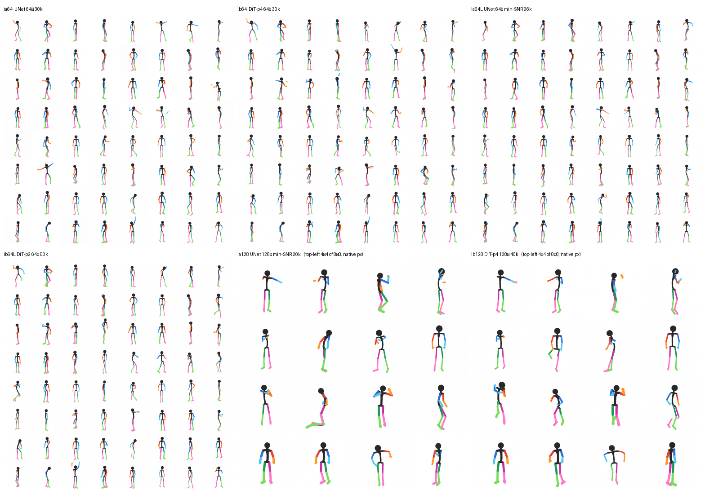

# Dancing Stick Figures: A Labeled Synthetic Benchmark for Consumer-GPU Video Diffusion

**Technical report draft · v0.1 results · 20 August 2026**

Sprited · [dataset](https://huggingface.co/datasets/sprited/dancing-stick-figures) ·
[code](https://github.com/sprited-ai/dancing-stick-figures) ·
[checkpoints](https://huggingface.co/sprited/dancing-stick-figures-baselines) ·
[Colab](https://colab.research.google.com/github/sprited-ai/dancing-stick-figures/blob/main/notebooks/dancing_stick_figures_colab.ipynb)

This document reports the public v0.1 release. It deliberately does not claim results for the planned learned pose
regressor, dense captions, text conditioning, or anomaly dataset.

---

## Abstract

Video-generation experiments are difficult to reproduce at small scale: videos are expensive to store and train on,
their structure is usually unobserved, and aggregate perceptual metrics do not say whether a generated person has a
missing or detached limb. We introduce **Dancing Stick Figures**, a compact synthetic benchmark built from 1,430
six-second text-to-motion sequences. Three deterministic camera views produce 4,290 rendered videos—514,800 frames
at 128×128 and 20 fps—with exact 3D and 2D joints, camera parameters, depth, normals, part segmentation, and raw
motion. The full release is 4.6 GB; a 64×64 training configuration is 0.85 GB.

The renderer gives each limb chain a known colour, allowing generated RGBA frames to be parsed without a learned
model. We release a transparent rule-based **oracle v0** that measures disconnected colour components, missing
skeleton adjacencies, colour impurity, and temporal instability. Controlled corruptions show that these measurements
detect partial left/right swaps and extra limbs while also exposing their intended blind spots: full chain swaps,
bone-length errors, and small missing extremities require geometry-aware evaluation. Real frames therefore define a
non-zero, resolution-dependent floor rather than an assumed score of zero.

We provide unconditional pixel-space diffusion baselines with two architectures: a 46 M-parameter factorised UNet
with v-prediction and a 33 M-parameter factorised DiT with flow matching. At 64×64, the strongest image UNet reaches
the real-data floor on topology violations. Initialising an 8-frame video UNet from the image model reaches a matched
training loss about 2.5× sooner than training from scratch, although the final oracle and FVD results are comparable.
An autoregressive variant trained for 60k steps rolls out 5-second dances while keeping per-frame topology and
adjacency errors within roughly 0.02 of real clips; its temporal jitter remains about 1.2–1.4× the real-data floor.
The dataset, generator, trainers, evaluation code, checkpoints, and an end-to-end free-T4 notebook are public.

## 1. Introduction

Large video models hide several questions that are useful to study in isolation. Does learning to draw one frame
make motion learning faster? How does a model fail at a chunk boundary? Does a lower perceptual distance also mean
fewer detached limbs? Answering such questions in real video requires pose annotation, a large training budget, and
often subjective review.

Dancing Stick Figures is designed as an **MNIST-like route through video generation**, not as a proxy for
photorealistic human video. We borrow motion from NVIDIA ARDY and own the rest of the data-generating process. The
renderer maps a known skeleton, body, and camera to pixels and labels in one pass. The resulting images are simple
enough for a small diffusion model to learn, but the motion and occlusion are real enough to create temporal and
anatomical failure modes.

The v0.1 release makes three contributions:

1. **A compact, fully traced motion-video dataset.** Every rendered frame is paired with the skeleton, camera, and
   G-buffer that produced it; the raw 27-joint motion is also released.
2. **A checkable structural baseline.** Oracle v0 parses the fixed limb palette directly from generated pixels and
   reports both frame and temporal errors next to a real-data floor.
3. **A reproducible small-compute route.** Public image, short-video, and autoregressive checkpoints cover a classic
   UNet recipe and an interim DiT/flow-matching track. The beginner route is sized for a free Colab T4.


**Figure 1.** Motions, seeds, and camera views in the dataset. Colour is structural: the four proximal/distal arm
and leg chains use eight known colours; torso, head, clavicles, and pelvis use the shared ink colour.

## 2. Positioning and related work

Synthetic datasets such as [Moving MNIST](https://arxiv.org/abs/1502.04681),
[CLEVRER](https://arxiv.org/abs/1910.01442), and [Kubric/MOVi](https://arxiv.org/abs/2203.03570) use controlled
generation to make temporal or physical state observable. Dancing Stick Figures takes the same general position but
targets articulated motion generation: its unit is a captioned 27-joint motion rendered from multiple cameras, and
its first evaluation target is limb structure rather than object identity or physical reasoning.

Human-motion resources such as [AMASS](https://arxiv.org/abs/1904.03278) and
[HumanML3D](https://arxiv.org/abs/2206.11605) provide rich motion representations. Here the motion source is
[ARDY](https://arxiv.org/abs/2607.08741), a text-to-motion model using the `cskel27` skeleton. We release ARDY's
generated motion outputs and our own renderings, not the source model or its training data. Dataset motion quality is
therefore bounded by ARDY's prompt following and motion distribution.

[Fréchet Video Distance (FVD)](https://arxiv.org/abs/1812.01717) embeds videos with a pretrained action-recognition
network and compares feature distributions. It is useful as a distribution-level measurement, but it does not
identify a specific structural failure. Our oracle measurements are complementary and intentionally narrow: they say
whether the known stick-figure palette still forms the expected graph and whether that graph is temporally stable.

The model baselines draw on [DDPM](https://arxiv.org/abs/2006.11239),
[v-prediction](https://arxiv.org/abs/2202.00512), [DiT](https://arxiv.org/abs/2212.09748), and
[flow matching](https://arxiv.org/abs/2210.02747). The image-to-video curriculum follows the scalable pattern
described by [Seedance 1.0](https://arxiv.org/abs/2506.09113): begin with low-resolution image training, initialise
the video model from the image model, and mix image and video tasks. Our implementation is a small pixel-space study,
not a reproduction of Seedance's latent model, data engine, or post-training system.

## 3. Dataset

### 3.1. Generation pipeline

The pipeline is:

> text prompt → ARDY motion → `cskel27` joints → per-motion body variation → three orthographic cameras →
> z-buffered capsule renderer → Parquet

The prompt set contains 143 English motion prompts in six groups: dance (34), gesture (30), locomotion (21),
transitions (15), idle (10), and sport (33). ARDY generates ten seeds per prompt, each six seconds long at 20 fps.
This produces 1,430 underlying motion clips. Each motion receives deterministic body parameters and three camera
views, giving 4,290 rendered clips and 514,800 frames.

Body variation is fixed within a motion: limb bone lengths vary by ±8%, torso bones by ±6%, scale by 50–58 pixels
per metre, and stroke width by 3–5 pixels. Cameras are orthographic. For each view, yaw is drawn 70% of the time from
a canonical yaw plus ±6° jitter and otherwise uniformly from the full circle; pitch is drawn from −3° to 10°.

The renderer draws z-buffered capsules at 4× supersampling and emits RGBA colour, 16-bit depth, camera-space normals,
and 27-part segmentation. Dataset construction is deterministic from `clip_id`; rebuilding from the same released
motion files, code version, and identifier reproduces the body and camera choices.

### 3.2. Released configurations and labels

| configuration | unit | rows | size | contents |
|---|---:|---:|---:|---|
| `frames` | rendered frame | 514,800 | 4.6 GB | 128² RGBA, depth, normals, segmentation, joints, camera, body |
| `mini` | rendered frame | 514,800 | 0.85 GB | 64² RGBA, segmentation, joints, camera, body |
| `motion` | underlying motion | 1,430 | 0.35 GB | world joints, local/global rotations, root tracks, foot contacts |

Each `frames` row contains a rendered-view `clip_id`, frame index, split, motion group, original prompt, seed, QA
flags, camera yaw/pitch/centre/scale, stroke and bone scales, 27×3 figure-frame joints, 27×2 projected joints, joint
depth and visibility, root position/velocity/heading, and the rendered buffers. The `motion` configuration stores the
corresponding source trajectory before camera rendering. Rendered view identifiers append `/c0`, `/c1`, or `/c2` to
the underlying motion identifier.


**Figure 2.** Colour, segmentation, depth, camera-space normals, and projected joints for one released frame.

### 3.3. Splits and quality flags

Splits are made by prompt, never by seed or camera. Thus every seed and view of a prompt remains in one split.
Thirty-three `sport` prompts are held out as an unseen-group test; four additional prompts from seen groups also land
in test.

| split | prompts | motion clips | rendered views | frames |
|---|---:|---:|---:|---:|
| train | 101 | 1,010 | 3,030 | 363,600 |
| validation | 5 | 50 | 150 | 18,000 |
| test | 37 | 370 | 1,110 | 133,200 |
| **total** | **143** | **1,430** | **4,290** | **514,800** |

The builder records `levitation` when the hips exceed the configured floor-relative threshold and `frozen` when mean
joint speed is below 0.02 m/s. Flagged examples remain in the release so users can choose a filtering policy. Prompts
whose generations failed manual contact-sheet review, including acrobatics and moonwalk, were removed before v0.1.
The v0.1 `text` field is the original motion prompt; label-derived dense captions are future work.

### 3.4. Paired visual domain

The same underlying motions and camera identifiers are also released as
[Dancing Chibi Figures](https://huggingface.co/datasets/sprited/dancing-chibi-figures), a volumetric chibi rendering
with paired depth, normals, segmentation, and motion-grounded captions. This pairing is not evaluated in the current
report; it provides a future controlled setting for studying representation and domain transfer while holding motion
and viewpoint fixed.

## 4. Oracle v0: render-based structural measurements

### 4.1. Definitions

Oracle v0 receives only an RGBA frame. Pixels are assigned to the nearest palette colour when their RGB distance is
within a fixed threshold. It then computes:

- **TVR (`tvr`, topology violation rate):** the fraction of the eight limb colours whose visible mask has a connected
  component count other than one. Missing, split, or duplicated colour regions increase the score.
- **LIE (`lie`, limb-identity/adjacency error):** the fraction of eight expected proximal–distal or torso–proximal
  colour adjacencies that are absent after a two-pixel dilation. A full left/right chain swap preserves the graph and
  is therefore invisible to this version.
- **CPE (`cpe`, colour purity error):** the fraction of foreground pixels farther than the threshold from every
  palette colour.
- **Clean:** the fraction of frames for which both TVR and LIE are zero.

For videos, the evaluator additionally measures colour-mass drift, foreground-centroid displacement (`head_jitter`
in the released JSON), second differences of each limb mask's principal-axis angle (`angle_jerk`), and variation in
figure height. These are image-space stability measurements, not estimates of biomechanical correctness.

Occlusion can split a real limb mask or hide an expected adjacency. Consequently, real validation frames have a
non-zero floor, and every model result must be interpreted beside a real sample measured at the same resolution,
window length, and sample count.

### 4.2. Controlled corruptions

We applied deterministic corruptions to 200 held-out rendered frames and re-ran the pixel parser.

| condition | TVR ↓ | LIE ↓ | CPE ↓ | foreground fraction |
|---|---:|---:|---:|---:|
| stored Parquet frame | .184 | .077 | .026 | .058 |
| clean re-render | .180 | .071 | .023 | .058 |
| partial left/right swap | .182 | **.271** | .029 | .058 |
| full left/right chain swap | .177 | .074 | .023 | .058 |
| stretch one bone | .189 | .070 | .023 | .059 |
| delete one hand | .176 | .070 | .022 | .057 |
| add an arm | **.268** | .064 | .029 | .062 |

The expected selective responses appear: a partial colour swap breaks adjacency and raises LIE, while an extra arm
fragments or duplicates a colour region and raises TVR. The non-responses are equally important. A full chain swap
preserves the colour graph; a stretched bone preserves connectivity; and a small hand shares its forearm colour, so
deleting it may not change either metric. Oracle v0 is therefore a transparent diagnostic for colour topology, not a
general anatomy score. A learned 2D-pose regressor and deliberately malformed render set are planned for geometry.

## 5. Baselines

### 5.1. Architectures and protocol

All reported v0.1 models are unconditional and operate directly on premultiplied RGBA pixels.

- **UNet:** 46 M-parameter factorised 3D UNet with spatial and temporal attention, cosine diffusion schedule,
  v-prediction, EMA weights, and 50-step DDIM sampling. A one-frame input bypasses temporal mixing.
- **DiT-FM:** 33 M-parameter factorised video transformer with alternating spatial and temporal blocks, adaLN-Zero,
  QK-normalisation, rectified-flow velocity prediction, logit-normal timesteps, and 50-step Euler sampling.

For image-to-video warm-starting, spatial weights are copied from the image checkpoint and the temporal contributions
begin at zero. At initialisation, the video model is therefore equivalent to applying the image model independently
to each frame. The finished comparison in v0.1 uses the UNet; the analogous DiT video runs are released as interim
checkpoints and are not included in the quantitative comparison.

Image evaluation uses 512 generated samples and 512 real validation frames, with 50 sampling steps. Short-video
evaluation uses 64 generated 8-frame windows for each of two sampling seeds and 64 real windows. FVD uses the released
Kinetics-400 I3D TorchScript evaluator after compositing RGBA over white and resizing to 224². Because each source
window has eight frames, frames are repeated to the 16-frame I3D minimum. The 64-sample estimate is small and is only
interpreted relative to the same-protocol real-versus-real floor; it should not be compared across implementations.

### 5.2. Image generation

| model | resolution | train steps | TVR ↓ | LIE ↓ | CPE ↓ | clean ↑ | real floor TVR / LIE / clean |
|---|---:|---:|---:|---:|---:|---:|---:|
| UNet, plain v-pred | 64² | 30k | .159 | .113 | .041 | .42 | .142 / .106 / .40 |
| DiT-FM, patch 4 | 64² | 30k | .176 | .122 | .040 | .38 | .143 / .108 / .37 |
| UNet, min-SNR-5 | 64² | 96k evaluated; 100k released | **.134** | .116 | **.039** | **.43** | .136 / .103 / .40 |
| DiT-FM, patch 2 | 64² | 50k | .164 | **.114** | .043 | .40 | .139 / .106 / .37 |
| UNet, min-SNR-5 | 128² | 20k | .226 | .073 | .020 | .22 | .203 / .047 / .23 |
| DiT-FM, patch 4 | 128² | 40k | .251 | **.065** | **.020** | **.23** | .209 / .048 / .21 |

At 64², the long UNet run is at the real-data TVR floor and within .013 LIE of its matched real sample. The 128²
models remain .023–.042 above the TVR floor at the evaluated checkpoints. Absolute scores should not be compared
between resolutions: thinner apparent strokes and different occlusion patterns change the parser's real-data floor.



**Figure 3.** Unconditional samples from released 64² and 128² image checkpoints. The contact-sheet layout and seeds
are fixed across model snapshots.

### 5.3. Short video and image warm-starting

| model | initialisation | train steps | TVR ↓ | LIE ↓ | head jitter ↓ | angle jerk ↓ | FVD ↓ |
|---|---|---:|---:|---:|---:|---:|---:|
| UNet video | random | 85k | .171 | **.101** | **.400** | **.125** | **199** |
| UNet video | 100k image UNet | 61k | **.154** | .115 | .412 | .129 | 213 |
| matched real windows | — | — | .125–.142 | .085–.109 | .322–.356 | .076–.077 | 110–119 |

The image-initialised model reaches the loss attained by the scratch model at 10k steps after approximately 4k
video steps, a 2.5× convergence-speed improvement. At the final evaluated checkpoints, neither model dominates: the
warm-started model has lower TVR, while the scratch model has lower LIE, temporal errors, and FVD. We therefore claim
a faster start, not higher converged quality. Both models' per-frame structural measurements are near the real floor,
but their angle jerk is about 1.6× the matched real value. FVD is 80–103 points above the small-sample real-real floor.

### 5.4. Autoregressive rollout

The released `unet_ar64.pt` conditions each newly generated 8-frame chunk on the preceding eight clean frames. It was
initialised from the image UNet and trained for 60k steps at 64² with stride 2, producing 10-fps output. On 32
five-second rollouts, the model/real scores are TVR .149/.128, LIE .121/.103, head jitter .69/.57, and angle jerk
.19/.14. Thus per-frame graph errors are within .018–.021 of the real floor, while temporal displacement and jerk are
approximately 1.2× and 1.4× the floor. Visual inspection localises much of the remaining instability to autoregressive
chunk seams; the reported metrics do not yet separate seam and within-chunk errors.


**Figure 4.** Eight unconditional autoregressive samples, 5.6 seconds each. The same checkpoint can roll out an
arbitrary number of chunks; quality rather than memory is the practical length limit.

## 6. Reproducibility and access

The public repository contains the deterministic renderer and builder, data cache, both trainers, rollout code, the
oracle, controlled corruptions, FVD evaluation, and checkpoint comparison scripts. The checkpoint repository includes
six image models, two finished 8-frame UNets, one finished autoregressive UNet, interim DiT video models, samples, and
model cards. The dataset card is the schema reference for v0.1.

The Colab notebook follows one route: inspect the `mini` data, build a cache, train a 64² image model, warm-start an
autoregressive video model, render a GIF, and compare oracle scores. It includes outputs from a real T4 run. The final
code path has been individually verified on T4; a fresh uninterrupted end-to-end run after the last fp16 and batch-size
fix remains to be recorded.

Licensing is separated by artifact: repository code is MIT and the released dataset is CC0-1.0. Motion was generated
with NVIDIA ARDY under the NVIDIA Open Model License; NVIDIA's license states that it claims no ownership of model
outputs. Users remain responsible for checking whether those terms fit their use.

## 7. Limitations

This release is intentionally narrow.

- It contains one figure at a time, orthographic cameras, one canonical visual design with modest body variation,
  128² maximum resolution, and 143 prompts.
- It is a synthetic rendering benchmark, not a substitute for real human video or mocap. Motion inherits errors and
  distribution limits from ARDY, and prompt adherence has not been scored systematically.
- v0.1 models are unconditional. The held-out `sport` split supports future conditional evaluation but is not evidence
  of concept generalisation in this report.
- Oracle v0 measures visible colour topology. Its real-data floor is caused by occlusion and resolution, and it cannot
  judge bone proportions, joint plausibility, full left/right swaps, or semantic prompt agreement.
- Temporal measurements are simple image-space proxies. Centroid motion confounds intended translation with jitter,
  and principal-axis angle becomes unstable for short or occluded segments.
- FVD uses only 64 short samples per seed, repeats frames to satisfy I3D's minimum temporal length, and has a high
  real-real floor. It is included as a within-protocol reference, not a leaderboard-quality estimate.
- The warm-start comparison uses one finished architecture and one run per condition. It supports a descriptive
  convergence observation, not a broad scaling claim.

## 8. Conclusion

Dancing Stick Figures turns a complete video-generation route into a small, inspectable experiment. The release links
motion, cameras, pixels, labels, training code, generated checkpoints, and evaluation rather than providing only one
piece of that chain. Its first result is modest but useful: image pretraining substantially accelerates early video
training in this setting, while final quality remains comparable, and long autoregressive rollouts preserve per-frame
limb topology better than their temporal smoothness.

The principal next step is not a larger generator. It is a geometry-aware evaluator: a released pose regressor,
controlled malformed renders, and a protocol that distinguishes intended motion from structural jitter. Dense
label-derived captions, conditional baselines, greater prompt diversity, and paired stick/chibi transfer experiments
can then build on a measurement layer whose capabilities and blind spots are explicit.

## Artifact citation

```bibtex
@misc{dancingstickfigures2026,
  title  = {Dancing Stick Figures: A Labeled Synthetic Benchmark for Consumer-GPU Video Diffusion},
  author = {{Sprited}},
  year   = {2026},
  url    = {https://huggingface.co/datasets/sprited/dancing-stick-figures}
}
```

## Appendix A. Metric implementation summary

The reference implementation is `eval/oracle.py`. Palette assignment uses an RGB Euclidean-distance threshold of 60
and foreground alpha greater than 0.5. A colour is considered present with at least four pixels. Connected components
use 8-connectivity. Adjacency is tested after two iterations of 3×3 binary dilation. TVR and LIE are averages over
eight limb colours and eight expected adjacency edges, respectively. Bootstrap 95% intervals for generated-image and
video measurements are stored in `paper/results/*.json`; tables in the main text use rounded point estimates for
readability.

## Appendix B. v0.2 measurement agenda

1. Train an image-to-27-joint regressor and report held-out PCK before using reprojection error on generated images.
2. Release an anomaly configuration containing controlled missing, extra, swapped, stretched, and disconnected parts.
3. Separate autoregressive seam errors from within-chunk errors and report confidence intervals for their difference.
4. Re-evaluate FVD with at least 256 videos and native 16-frame windows; compare checkpoint rankings with structural
   measurements and document disagreements.
5. Add deterministic static/dynamic captions from labels, then evaluate group and text conditioning on prompt-held-out
   and `sport`-held-out splits.
